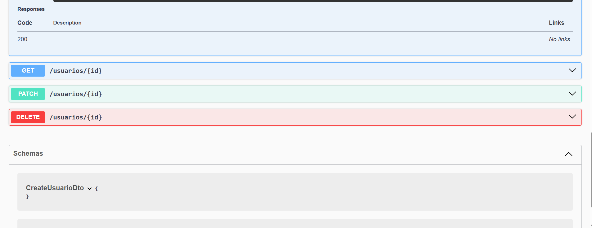
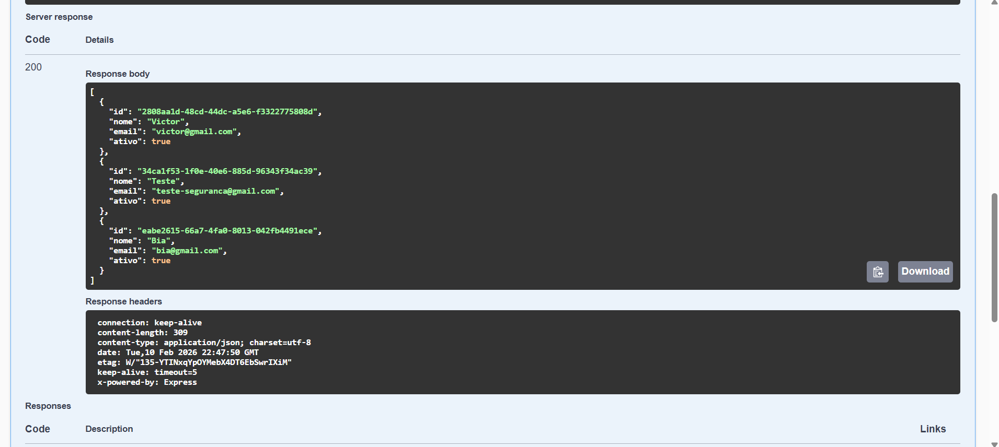

#  Projeto Backend Victor  - API Backend

> API RESTful desenvolvida para promover a inclusão digital, focada em segurança, escalabilidade e documentação clara. CORREÇÃO: Estou usando essa API de treino para o projeto real.

Este projeto é o backend da plataforma "Idoso Conectado". Ele gerencia o cadastro de usuários aplicando regras de negócio estritas, criptografia de dados sensíveis e validação automática.

## 🚀 Tecnologias Utilizadas

O projeto foi construído utilizando as melhores práticas do mercado:

* **[NestJS](https://nestjs.com/)**: Framework Node.js progressivo e modular.
* **[TypeORM](https://typeorm.io/)**: ORM para manipulação segura de Banco de Dados.
* **[PostgreSQL](https://www.postgresql.org/)**: Banco de dados relacional robusto.
* **[Bcrypt](https://www.npmjs.com/package/bcrypt)**: Criptografia de senhas (Hashing) para segurança nível industrial.
* **[Swagger](https://swagger.io/)**: Documentação automática e interativa da API.
* **[Class-Validator](https://github.com/typestack/class-validator)**: Validação de dados de entrada (DTOs).

---

## 📸 Funcionalidades e Prints

### 1. Documentação Interativa (Swagger)
A API conta com uma interface gráfica automática. Desenvolvedores Frontend e Mobile podem testar as rotas e entender os contratos de dados sem precisar ler o código fonte.

### 2. Segurança de Dados (Criptografia)
Segurança é prioridade. As senhas dos usuários **nunca** são salvas em texto plano. Utilizamos Hash (Bcrypt) para garantir que, mesmo em caso de vazamento de banco de dados, as contas estejam protegidas.

### 3. Validação e Tratamento de Erros
A API impede cadastros duplicados e dados inválidos, retornando mensagens de erro claras (HTTP 400 e 409) para o cliente.

## 🛠️ Como rodar o projeto local
